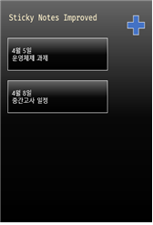
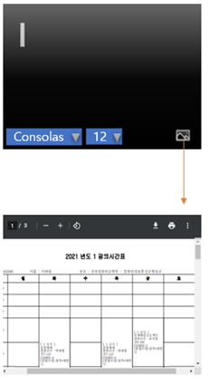

# Sticky-Note-Improved
[](https://standardjs.com)
[](https://www.codacy.com/gh/ShapeLayer/Sticky-Note-Improved/dashboard?utm_source=github.com&amp;utm_medium=referral&amp;utm_content=ShapeLayer/Sticky-Note-Improved&amp;utm_campaign=Badge_Grade)  
Sticky Note Improved는 공학설계입문(이칠우 교수) 4팀 프로젝트입니다.

## 라이브러리 설치
```bash
npm install
```

## 프로젝트 실행
```bash
npm start # Build Frontend and Start Application
npm run build # Build Frontend
npm run open # Start Application
```

## 폴더 구조
```
├─ app
│  ├─ out : 번들링 결과 (npm run build 결과)
│  ├─ renderer : 렌더러 프로세스 (번들링 이전)
│  └─ ?? : 메인 프로세스
├─ docs : 문서 관련 자료 디렉토리
└─ main.js : 프로그램 진입점 (package.json 에서 정의)
```

## 프로토타입
[Figma](https://www.figma.com/proto/5ZyfEqvnN36g2hPs7rle0u/Advanced-Sticky-Note?node-id=1%3A2&scaling=min-zoom&page-id=0%3A1)

### 이전 버전
Default  
  

Font Settings  
  

Add Memo   
  

Add PDF  
  