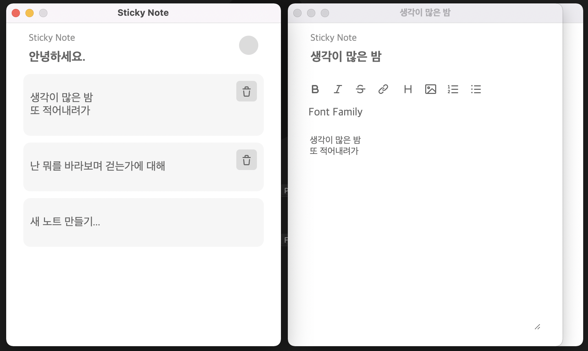
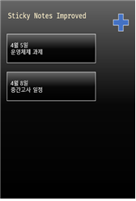
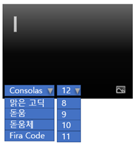
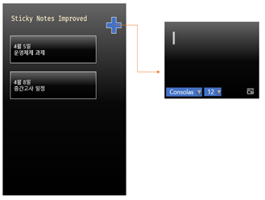
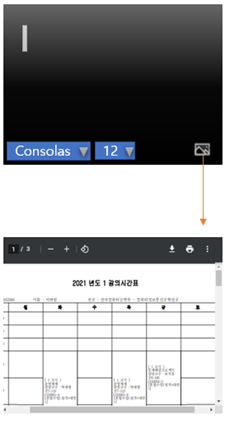

# Sticky-Note-Improved
[](https://standardjs.com)  

<!---->
[](#)  

Sticky Note Improved는 공학설계입문(이칠우 교수) 4팀 프로젝트입니다.

## 시작하기
### 라이브러리 설치
```bash
npm install
```

### 프로젝트 실행
본 프로젝트는 웹팩을 통해 코드를 번들링하여 사용하고 있습니다.  
따라서 최초 1회 프로젝트를 빌드해야 프로젝트를 실행할 수 있습니다.  

```bash
npm start # Build Frontend and Start Application
```

npm 시작 스크립트는 코드 번들링과 애플리케이션 실행을 모두 수행합니다.  
하지만 여타 요인으로 인해 두 작업 중 하나만 수행하려고 하는 경우, 아래와 같이 부분적으로 작업을 실행할 수 있습니다.

```bash
npm run build # Build Frontend
npm run open # Start Application
```

## 기술 명세
[`./docs` 문서를 참조하세요.](./docs)

## 프로토타입
[](https://www.figma.com/proto/5ZyfEqvnN36g2hPs7rle0u/Advanced-Sticky-Note?node-id=1%3A2&scaling=min-zoom&page-id=0%3A1)

<details>
    <summary>(이전 버전 프로토타입 보기)</summary>

Default  
  

Font Settings  
  

Add Memo   
  

Add PDF  
  
</details>
